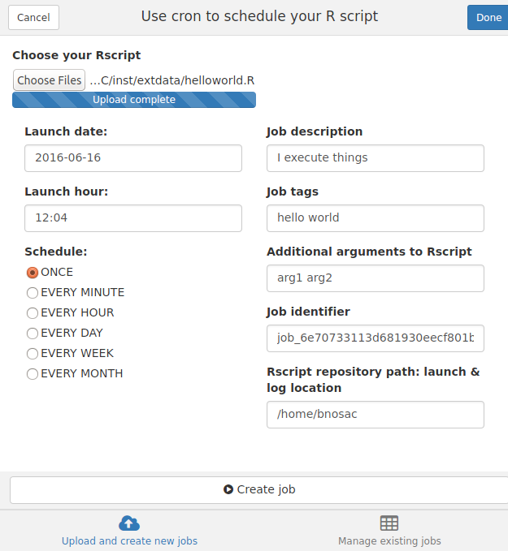

cronR
=========

 

Schedule R scripts/processes with the cron scheduler. This allows R users working on Unix/Linux to automate R processes on specific timepoints from R itself.
Mark that if you are looking for a Windows scheduler, you might be interested in the R package taskscheduleR available at
https://github.com/jwijffels/taskscheduleR


Basic usage
-----------

This R package allows to 
* Get the list of scheduled jobs
* Remove scheduled jobs
* Add a job
  + A job is basically a script with R code which is run through Rscript
  + You can schedule tasks 'ONCE', 'EVERY MINUTE', 'EVERY HOUR', 'EVERY DAY', 'EVERY WEEK', 'EVERY MONTH' or any complex schedule
  + The task log contains the stdout & stderr of the Rscript which was run on that timepoint. This log can be found at the same folder as the R script

When the task has run which is scheduled with the RStudio addin, you can look at the log which contains everything from stdout and stderr. The log file is located at the directory where the R script is located.


RStudio add-in
-----------

The package contains also an RStudio add-in. If you install the package and use RStudio version 0.99.893 or later you can just click to schedule a task. Just click Addins > Schedule R scripts on Linux/Unix.

 

Install
-----------

Install the latest version from github:
```
devtools::install_github("jwijffels/cronR")
```

If you want the RStudio add-in to work, also install miniUI and shiny
```
install.packages('miniUI')
install.packages('shiny')
```

Warning
-----------

Currently, `cronR` does not preserve or handle cron jobs not
generated through the package. This will be handled some time in
the future. To be safe, you should run `cron_save("cron.backup")`
before fiddling around.

